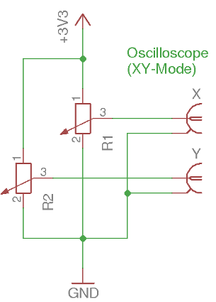
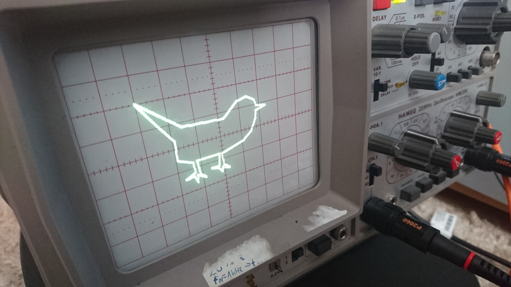

# Scopescreen

Scopescreen ermöglicht es ein analoges Oszilloskop als Bildschirm zu verwenden.

## Idee

Die Idee stammt vom Spiel [Osziflap](https://pintman.github.io/osziflap/), bei
dem ein analoges Oszilloskop als Bildschirm verwendet wird. Um die Signale für
das Oszilloskop zu erzeugen, werden R-2R-Netzwerke als Digital-Analog-Wandler
an der GPIO-Schnittstelle eines Raspberry Pi verwendet. Da sich die I/O-Pins
nicht schnell genug schalten ließen, hatte Osziflap noch eine relativ geringe
Auflösung. Bei Überlegungen zur Verbesserung der Auflösung ist dieses Projekt
entstanden.

## Funktionsweise

Mit einem Oszilloskop werden normalerweise Spannungsverläufe dargestellt. Dazu
wird der Elektronenstrahl kontinuierlich in x-Richtung (horizontal) ausgelenkt.
Die Auslenkung in y-Richtung (vertikal) hängt von der Spannung am Eingang ab.
Die meisten Oszilloskope haben einen XY-Mode. Dabei wird auch die Auslenkung
des Elektronenstrahls in x-Richtung von einer Spannung an einem weiteren Eingang
bestimmt. Dadurch lässt sich an jeder Stelle auf dem Bildschirm ein Punkt
erzeugen. Durch die Änderung der Eingangsspannungen wird der Punkt bewegt.
Bewegt man den Punkt schnell genug, so nimmt das (träge) menschliche Auge ein
stehendes Bild war.

Die Schwierigkeit besteht darin, die Spannungen an den beiden Eingängen des
Oszilloskops schnell genug auf einen beliebigen Wert zu verändern. Dazu werden
zwei Digitalpotentiometer verwendet.

An die äußeren Poti-Kontakte (1 und 2) wird dabei eine feste Spannung angelegt.
Der Schleifer des Potentiometers (Kontakt 3) teilt die Spannung abhängig von
seiner Position. Der Schleifer wird schließlich am Eingang des Oszilloskops
angeschlossen.

In der ersten Version werden zwei Digitalpotentiometer `MCP4151` verwendet, die
über die SPI-Schnittstelle eines Raspberry Pi angesteuert werden. Eine
kurze Beschreibung befindet sich im
[Hardware-101](https://tbs1-bo.github.io/hardware-101/mcp4151/).

## Beispiel

## 3D Engine

Aktuelle Version:

Alte Versionen:

